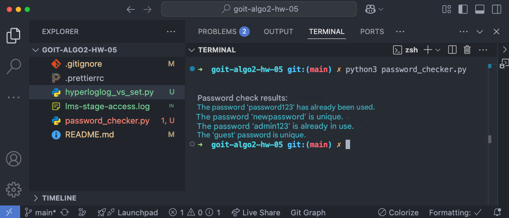
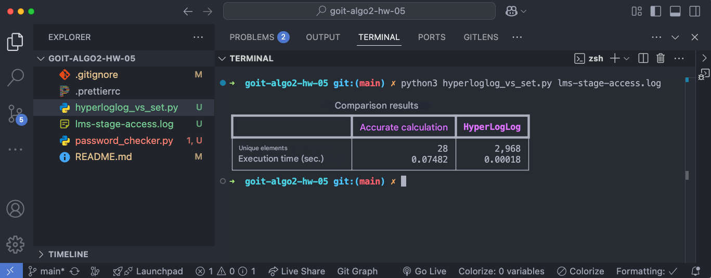

# Homework on the topic "Algorithms for working with big data"

Congratulations! How are you? We hope that you are looking forward to a new
challenge 😉

Today you will gain skills in using Bloom filters and the HyperLogLog algorithm
when solving problems.

The homework will consist of two independent tasks.

Implementing the first task — checking the uniqueness of passwords — will
prepare you for the development of systems for working with big data, where
memory conservation and processing speed are critically important.

By completing the second task, you will learn to work with different approaches
to counting unique elements in large data sets, including exact methods and
approximate algorithms, such as HyperLogLog. You will gain experience in
analyzing the performance of algorithms using runtime metrics. This task will
help develop skills in optimizing work with big data and will teach you how to
apply modern methods to effectively solve problems.

Let's get started?! 💪🏼

## Task 1. Checking the uniqueness of passwords using a Bloom filter

Create a function to check the uniqueness of passwords using a Bloom filter.
This function should determine whether a password has been used before, without
the need to store the passwords themselves.

### Specifications

1. Implement the `BloomFilter` class, which provides adding elements to the
   filter and checking the presence of an element in the filter.

2. Implement the `check_password_uniqueness` function, which uses an instance of
   `BloomFilter` and checks the list of new passwords for uniqueness. It should
   return the check result for each password.

3. Ensure correct processing of all data types. Passwords should be treated
   simply as strings, without hashing. Empty or incorrect values ​​should also
   be taken into account and handled properly.

4. The function and class should work with large data sets, using a minimum of
   memory.

### Acceptance criteria

📌 The homework acceptance criteria are a prerequisite for the assignment to be
considered by the mentor. If any of the criteria are not met, the homework is
sent by the mentor for revision without grading. If you "just need
clarification"😉 or you are "stuck" at any stage of execution - contact the
mentor in Slack.

1. The `BloomFilter` class implements the logic of working with the Bloom filter
   (20 points).

2. The `check_password_uniqueness` function checks new passwords using the
   passed filter (20 points).

3. The code executes the use case according to the expected results (10 points).

### Usage Example

```python
if **name** == "**main**": # Initialize Bloom Filter bloom =
BloomFilter(size=1000, num_hashes=3)

# Add existing passwords
existing_passwords = ["password123", "admin123", "qwerty123"]
for password in existing_passwords:
bloom.add(password)

# Check new passwords
new_passwords_to_check = ["password123", "newpassword", "admin123", "guest"]
results = check_password_uniqueness(bloom, new_passwords_to_check)

# Print results
for password, status in results.items():
print(f"Password '{password}' - {status}.")
```

### Result

```bash
Password 'password123' is already used.
Password 'newpassword' is unique.
Password 'admin123' is already used.
Password 'guest' is unique.
```

## Task 2. Comparing HyperLogLog performance with exact unique element counting

Create a script to compare exact unique element counting and counting using
HyperLogLog.

### Specifications

1. Load a dataset from a real log file `lms-stage-access.log` that contains
   information about IP addresses.

2. Implement a method for exact unique IP address counting using the set
   structure.

3. Implement a method for approximate unique IP address counting using
   HyperLogLog.

4. Compare the methods by execution time.

Acceptance criteria

1. The data loading method processes the log file, ignoring invalid rows (10
   points).

2. The exact count function returns the correct number of unique IP addresses
   (10 points).

3. HyperLogLog shows the result with an acceptable error (10 points).

4. The comparison results are presented in a table (10 points).

5. The code is adapted to large data sets (10 points).

### Example of output

```bash
Comparison results:
Exact count HyperLogLog
Unique elements 100000.0 99652.0
Run time (sec) 0.45 0.1
```

## Preparing and uploading homework

1. Create a public repository `goit-algo2-hw-05`.

2. Complete the task and submit it to your repository.

3. Download the working files to your computer and attach them to the LMS as a
   zip archive. The archive name should be in the format DZ5_NAME.

📌The log file is too large, so do not attach it to the LMS: it will probably
not work due to limitations.

4. Attach a link to the `goit-algo2-hw-05` repository and send it for review.

## Forms at submission

- Attached repository files in zip format with the name DZ5_NAME.

- Link to the repository.

## Evaluation format

Score from 0 to 100.

Task 1 is evaluated at 50 points.

Task 2 is evaluated at 50 points.

Detailed distribution of points is indicated in the acceptance criteria.

☝🏻ATTENTION!! You have the opportunity to choose an approach to completing and
possible revision of the homework:

1. Be satisfied with the first grade received (of course, if it is higher than
   the passing score).
2. Try to get a higher score through possible subsequent revision of the work in
   accordance with the mentor's feedback. The chosen approach to completing the
   DZ must be indicated in the submission field for the attached task. In the
   absence of a comment, the mentor adheres to the first approach and sets the
   received grade.

💡 Send the assignment for verification when everything possible has been done,
since the number of attempts to complete the assignment affects the score! For
each subsequent attempt, starting from the third, the maximum possible number of
points is reduced by 5. Criteria for evaluating works in the GoIt Neoversity
master's degree

### Result of the completed assignment

#### Assignment 1



#### Assignment 2


